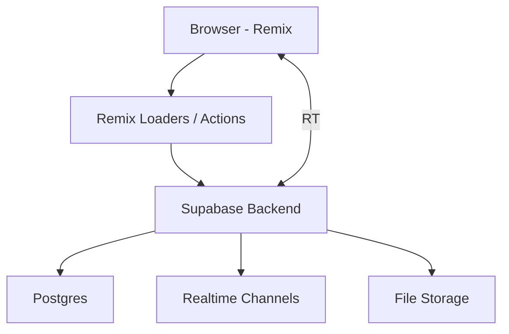

# Calebsons Remix + Supabase — Realtime Collaboration App

## Overview
A real-time collaboration app using Remix loaders/actions and Supabase realtime features.

## Tech Stack
- Remix
- Supabase
- PostgreSQL
- TypeScript

## Features
- Realtime presence
- Shared editing
- File uploads
- Offline-first sync
- Auth + RBAC

## Architecture

## Setup
    npm install
    npm run dev

## Deployment
- Fly.io
- Supabase hosting

## Roadmap
- Add voice rooms
- Add document versioning
